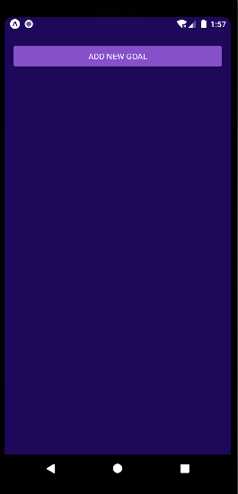
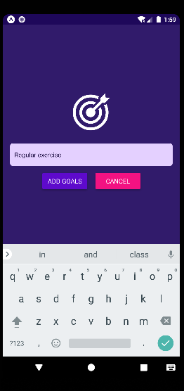
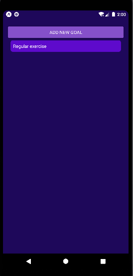

# GoalApp  

Welcome to the "GoalApp" repository! This is an Android application built with React Native and Android Studio that allows you to set and track your personal goals.

## Features

- **Goal List**: The main screen displays all your goals in a scrollable list. You can see an overview of your goals at a glance.
- **Add Goal**: The app provides a button on top of the goal list to add new goals. Simply tap the button to add a goal to your list.
- **Goal Completion**: Once you have achieved a goal, you can delete it from the list by tapping on it.

## Screenshots

 
 
 

## How to Play

1. Clone the repository to your local machine:

   ```
   git clone  https://github.com/Hafilu/GoalApp.git
   ```

2. Navigate to the project directory:

   ```
   cd  GoalApp
   ```

3. Install the required dependencies:

   ```
   npm install
   ```

4. Run the app on a simulator or device:

   ```
   npm start
   ```

   This will launch the Metro Bundler and provide options for running the app on an iOS or Android simulator or device.

## Dependencies

The GoalApp project has the following dependencies:

- React Native: The core framework for building mobile applications.
- Android Studio: The primary development environment for Android applications.
- Other dependencies are listed in the `package.json` file.

Make sure to install any required dependencies before running the application.

## Contributing

Contributions are welcome! If you encounter any issues or have suggestions for improvements, please create an issue or submit a pull request. Please follow the existing coding style and conventions.

## Contact

If you have any questions, suggestions, or feedback, please feel free to contact me at hafliue.c@gmail.com.

Thank you for visiting the "GoalApp" repository. Start setting and achieving your goals today!
